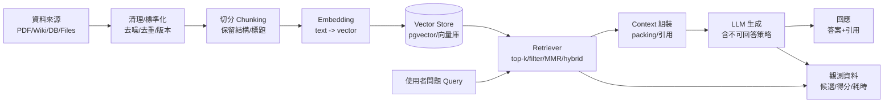

# 02-端到端資料流與系統架構

## 你將學到（Learning Objectives）

- 能畫出一套 RAG 的端到端資料流（從文件到答案）
- 能在 Django 系統中選擇合適的導入架構（單體 / 分離服務 / 混合）
- 知道每個模組的責任邊界：哪裡該做權限、哪裡該做觀測、哪裡該做版本化

## 本章地圖

- **適合用在**：要把 RAG 拆成工程模組、定責任邊界與資料流時。
- **你會做出**：端到端流程圖、可替換介面、最小上線責任清單。
- **最可能踩雷**：權限/觀測/版本化放錯層，導致越權或不可回放。

## 端到端資料流（概念）

## 你需要的 4 條「可替換」主線

- **資料主線**：loader → 清理 → 切分 →（可重跑）→ 入庫
- **檢索主線**：query →（改寫/擴展）→ 多路召回 → rerank → 選 context
- **生成主線**：模板 → 引用 → 不可回答/追問 → 輸出格式（可讀/可解析）
- **評估主線**：離線集 → 指標 → 線上回饋 → 失敗分類 → 迭代

## Django 導入的 3 種架構（你需要能選）

### 架構 A：單體 Django（最容易起步）

**適用**：PoC/試點、小流量、團隊希望先在現有 codebase 內快速導入。

- **優點**：部署簡單；權限/使用者資料本來就在 Django；開發門檻低
- **缺點**：ingest/indexing 可能拖慢 web；資源隔離差；後續擴展較痛

建議做法：
- 索引管線放背景任務（Celery/RQ/cron），不要在 request thread 做
- 生成呼叫與檢索要有 timeout / circuit breaker / 快取

### 架構 B：Django + 獨立 RAG Service（最常見、可上線主流）

**適用**：要穩定上線、要把 RAG 能力做成可被多系統共用的內部服務。

- **優點**：可水平擴展；可獨立部署與觀測；可隔離敏感 prompt/模型金鑰
- **缺點**：多一個服務要維運；需要把權限/租戶資訊可靠地傳遞（JWT/簽名）

常見切分：
- Django（產品）負責：身份、授權、UI/API、審計、業務規則
- RAG service 負責：檢索、rerank、context packing、生成（透過抽象 LLM adapter）

### 架構 C：三段式（Ingest/Index 與 Query 分開）

**適用**：文件量大、更新頻繁，或 ingest 需要較重的轉檔/抽取（PDF OCR、表格抽取）。

分法：
- **Ingest worker**：拉資料、清理、切分、產生 chunks（可重跑）
- **Index worker**：embedding、寫入向量庫、建索引（可回補）
- **Query service**：只做線上檢索/生成（穩定與低延遲優先）

## 供應商不綁定：你要抽象的是哪些介面

- **LLM（Generate）**：輸入 prompt/context → 輸出文字/JSON（可串流）
- **Embedding**：輸入 texts → 輸出 vectors（含維度與模型版本）
- **Rerank（可選）**：輸入（query, candidates）→ 輸出排序/分數

你會在 `07-工程化與上線` 章節看到如何在 Django 內導入這些抽象層，讓你後續能換供應商而不翻修整個系統。

## 最小上線必備的「責任邊界」清單

- **權限/租戶隔離**：必須在檢索層做（metadata filter），不是只在 UI 做
- **可觀測性**：每次問答要能回放：查了什麼、取了什麼 chunk、為何引用
- **版本化**：至少要能回答「這個答案用的是哪版資料/embedding/提示」
- **失敗處理**：證據不足要拒答/追問；LLM timeout 要降級；不要默默亂答

## 本章小結

- 端到端主線是：資料 → 切分 → 向量化 → 儲存 → 檢索 → 組裝 → 生成 → 回應（含引用）。
- 供應商不綁定的核心在於抽象 LLM/Embedding/Rerank 介面與版本化管理。
- 上線必備的責任邊界：檢索層權限、全流程可觀測、最小版本化與失敗處理。

## 延伸閱讀

- [03-Metadata與權限欄位設計（ACL-租戶隔離）](../02-資料工程（最容易踩雷的地方）/03-Metadata與權限欄位設計（ACL-租戶隔離）.md)
- [03-可觀測性：log-trace-命中率-失敗分類](../06-評估與觀測（讓工程團隊能迭代）/03-可觀測性：log-trace-命中率-失敗分類.md)
- [01-系統切分：Ingest-Index-Retrieve-Generate服務邊界](../07-工程化與上線（Django+Postgres實作）/01-系統切分：Ingest-Index-Retrieve-Generate服務邊界.md)
